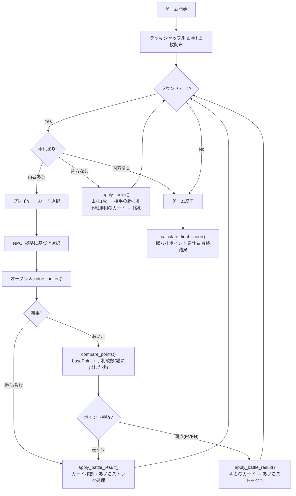

# Shadow Bout v0.1 — Streamlit NPCバトルアプリ

じゃんけんカードゲーム「シャドウバウト」をNPC相手に遊べるStreamlitアプリを作成する。v0.1ではカード効果を省略し、**じゃんけん部分のみ**を実装する。

## v0.1 スコープ

### 含めるもの
- デッキのシャッフル → 手札5枚配布
- 4ラウンドのじゃんけん勝負
- カード選択 → オープン → 勝敗判定
- あいこ時のポイント勝負（効果を省くため、basePoint + 手札枚数で比較）
  - ※手札枚数は「場にカードを出した後」の残り枚数で計算する
- 完全引き分け時のあいこストック処理
- 勝ち札のポイント集計 → 最終勝敗
- 不戦敗ルール（手札切れ時）

### 含めないもの（v0.2以降）
- カード効果（全て無視する）
- 桃子のワイルドカード宣言

## 使用デッキ（13枚・両プレイヤー共通）

| カード名 | ID | じゃんけん | basePoint |
|---|---|---|---|
| 百合子 | card_26 | パー | 15 |
| 杏奈 | card_24 | グー | 17 |
| 未来 | card_14 | グー | 12 |
| 亜美 | card_11 | チョキ | 12 |
| ロコ | card_25 | グー | 15 |
| 静香 | card_15 | パー | 20 |
| 千鶴 | card_38 | チョキ | 13 |
| 千早 | card_02 | グー | 13 |
| 貴音 | card_08 | チョキ | 15 |
| 真 | card_06 | チョキ | 18 |
| 瑞希 | card_44 | パー | 17 |
| ジュリア | card_50 | チョキ | 13 |
| やよい | card_05 | パー | 15 |

**マーク分布**: グー4枚 / チョキ5枚 / パー4枚

---

## 設計方針

- **ドメインロジックはStreamlitに依存しない**: ゲームのルール・状態遷移・判定はすべて `shadow_bout` パッケージ内で完結させる。Streamlit（`app.py`）はドメイン層を呼び出して表示するだけの薄いView層とする。
- **判定と状態変更を分離する**: じゃんけん判定は純粋関数（副作用なし）として実装し、状態変更は別関数で行う。v0.2でカード効果を「判定と状態変更の間」に差し込めるようにする。
- **Phase遷移はドメイン関数経由**: Phase の変更は必ずドメイン層の関数呼び出しの結果として起こる。Streamlit側が `game_state.phase` を直接書き換えることはしない。UIは「ユーザー入力をドメイン関数に渡す」だけに徹する。
- **テスタビリティ**: ドメインロジックは `pytest` で自動テスト可能にする。

---

## ファイル構成

```
shadow_bout/
├── __init__.py
├── models.py       # データクラス定義 (Card, PlayerState, GameState, etc.)
├── cards.py        # cards.jsonl の読み込み
├── engine.py       # ゲーム進行ロジック (init, judge, apply, score)
└── npc.py          # NPC戦略 (Protocol + RandomStrategy)
app.py              # Streamlit UI（shadow_bout パッケージを import）
cards.jsonl         # カードデータ
requirements.txt
tests/
└── test_engine.py  # ドメインロジックのテスト
```

---

## ドメイン層: `shadow_bout` パッケージ

### [NEW] shadow_bout/models.py

データクラスと列挙型の定義。ゲームの語彙を型として表現する。

```python
class Janken(Enum):
    ROCK = "rock"
    SCISSORS = "scissors"
    PAPER = "paper"

class Phase(Enum):
    START = "start"
    SELECT = "select"
    REVEAL = "reveal"
    RESULT = "result"

class JankenResult(Enum):
    """じゃんけんの三すくみ判定結果（judge_janken の戻り値）"""
    WIN = "win"
    LOSE = "lose"
    DRAW = "draw"         # あいこ → ポイント比較に進む

class RoundOutcome(Enum):
    """1ラウンドの最終結果（BattleResult.outcome の型）"""
    WIN = "win"
    LOSE = "lose"
    EVEN = "even"         # 完全引き分け（あいこストックへ）

class Side(Enum):
    PLAYER = "player"
    NPC = "npc"
```

`JankenResult` と `RoundOutcome` を分離する理由:
- `judge_janken` の DRAW（じゃんけんあいこ → ポイント比較に進む）と、ラウンド最終結果の EVEN（ポイントも同点 → あいこストック）は異なる概念
- v0.2 でカード効果がじゃんけん結果を書き換える場面（例: マーク変更）で、**どのレベルの結果を操作しているか** が型で区別できる

- **`Card` dataclass**: id, name, kana, janken (`Janken`), base_point を保持
- **`PlayerState` dataclass**: hand (手札), deck (山札), discard (捨札), won_cards (勝ち札), draw_stock (あいこストック)
- **`GameState` dataclass**: player, npc の `PlayerState`、round_number, phase (`Phase`), battle_log
  - `phase` はドメイン層が管理する。Streamlit側は `GameState.phase` を読んで表示を切り替えるだけ。

```python
@dataclass
class BattleResult:
    outcome: RoundOutcome               # WIN / LOSE / EVEN
    winning_side: Side | None           # EVEN の場合は None
    player_card: Card
    npc_card: Card
    janken_result: JankenResult         # じゃんけん段階の結果（WIN/LOSE/DRAW）
    player_point: int | None            # あいこ時のみ（ポイント比較した場合）
    npc_point: int | None               # あいこ時のみ
```

---

### [NEW] shadow_bout/cards.py

カードデータへのアクセスを担当する。

- `load_deck(card_ids: list[str], jsonl_path: Path) -> list[Card]`: cards.jsonl から指定IDのカードを読み込み、`Card` オブジェクトのリストを返す

---

### [NEW] shadow_bout/engine.py

ゲーム進行のコアロジック。すべて**純粋関数**（または `GameState` を受け取って新しい `GameState` を返す関数）として実装し、Streamlit に依存しない。

#### 初期化

- `init_game(deck: list[Card]) -> GameState`: デッキをシャッフルし、手札5枚を配布した `GameState` を返す。
  - 戻り値で返す純粋関数。`st.session_state` には触らない。

#### じゃんけん判定（純粋関数・副作用なし）

- `judge_janken(card_a: Card, card_b: Card) -> JankenResult`:
  グー・チョキ・パーの三すくみ判定のみ。WIN / LOSE / DRAW を返す。

- `compare_points(card_a: Card, hand_size_a: int, card_b: Card, hand_size_b: int) -> RoundOutcome`:
  あいこ時のポイント比較。`base_point + hand_size`（場に出した後の手札枚数）で比較し、WIN / LOSE / EVEN を返す。

#### 状態変更

- `apply_battle_result(game_state: GameState, result: BattleResult) -> GameState`:
  判定結果に基づいてカード移動を実行し、新しい `GameState` を返す。

  **勝敗時のカード移動**:
  - 勝者: 相手の場のカード → 自分の勝ち札。加えて、相手のあいこストック → 自分の勝ち札。
  - 敗者: 自分の場のカード → 自分の捨札。加えて、自分のあいこストック → 自分の捨札。

  **完全引き分け（EVEN）時**:
  - 両者の場のカード → 各自のあいこストック

#### 不戦敗

- `check_forfeit(player: PlayerState, npc: PlayerState) -> Side | None`:
  どちらかの手札が0枚の場合、不戦敗側を返す。両方0枚の場合は `None`（ゲーム終了）。

- `apply_forfeit(game_state: GameState, forfeiting_side: Side) -> GameState`:
  不戦敗処理を実行し、新しい `GameState` を返す。
  - 不戦敗側: 山札の上から1枚めくり、そのカードが相手の勝ち札となる。
  - 不戦勝側: 場に出したカードを自分の捨札に移動する。

#### スコア計算

- `calculate_final_score(state: PlayerState) -> int`: 勝ち札の `base_point` 合計

#### Phase 遷移を伴うアクション

Phase の変更はすべて以下の関数の戻り値として起こる。Streamlit 側が `game_state.phase` を直接変更することはない。

- `start_game(deck: list[Card]) -> GameState`:
  `init_game` を呼び出し、`phase = Phase.SELECT` の `GameState` を返す。
  （`Phase.START` → `Phase.SELECT` の遷移）

- `select_card(game_state: GameState, player_card: Card, npc_strategy: NpcStrategy) -> GameState`:
  プレイヤーのカード選択を受け付け、NPC のカード選択も実行し、`resolve_round` を呼び出してラウンドを解決する。`phase = Phase.REVEAL` の `GameState` を返す。
  （`Phase.SELECT` → `Phase.REVEAL` の遷移）

- `proceed_to_next(game_state: GameState) -> GameState`:
  REVEAL 画面の「次へ」ボタン押下時に呼ばれる。次のラウンドがあれば `phase = Phase.SELECT`、なければ `phase = Phase.RESULT` の `GameState` を返す。不戦敗チェック（`check_forfeit`）もここで行う。
  （`Phase.REVEAL` → `Phase.SELECT` or `Phase.RESULT` の遷移）

#### ラウンド管理（内部関数）

- `resolve_round(game_state: GameState, player_card: Card, npc_card: Card) -> GameState`:
  1ラウンドの処理をまとめる内部関数。`judge_janken` → `compare_points`（あいこ時）→ `apply_battle_result` を順に呼び出す。
  - v0.2 ではこの関数内に `apply_effects()` の呼び出しを追加するだけで拡張できる。

---

### [NEW] shadow_bout/npc.py

NPC戦略を分離。将来的に複数の戦略を差し替え可能にする。

```python
class NpcStrategy(Protocol):
    def select_card(self, hand: list[Card], game_state: GameState) -> Card: ...

class RandomStrategy:
    """v0.1: 手札からランダムに1枚選択"""
    def select_card(self, hand: list[Card], game_state: GameState) -> Card:
        return random.choice(hand)
```

`game_state` を引数に取ることで、v0.2以降で「相手の捨て札を見て判断する」などの戦略も実装可能。

---

## View層: Streamlit UI

### [NEW] app.py

StreamlitのメインUI。`st.session_state` に `GameState` を丸ごと保持し、ドメイン層の関数を呼び出す薄いView層。**Phase の遷移はドメイン関数の戻り値を `session_state` に格納することでのみ起こる。**

```python
# app.py のイメージ — Streamlit は入力をドメイン関数に渡すだけ
game_state: GameState = st.session_state.game_state

if game_state.phase == Phase.START:
    if st.button("ゲーム開始"):
        st.session_state.game_state = start_game(deck)
        st.rerun()

elif game_state.phase == Phase.SELECT:
    selected = render_card_buttons(game_state.player.hand)
    if selected:
        st.session_state.game_state = select_card(game_state, selected, npc_strategy)
        st.rerun()

elif game_state.phase == Phase.REVEAL:
    render_battle_result(game_state)
    if st.button("次へ"):
        st.session_state.game_state = proceed_to_next(game_state)
        st.rerun()

elif game_state.phase == Phase.RESULT:
    render_final_result(game_state)
```

このパターンにより、Streamlit 側は `game_state.phase` を直接書き換えず、常にドメイン関数の戻り値で `GameState` を丸ごと置き換える。

**画面構成**:

```
┌──────────────────────────────────────┐
│  🎴 シャドウバウト v0.1              │
│  ラウンド 2/4                        │
├──────────────────────────────────────┤
│  【NPC】                             │
│  手札: 4枚 | 山札: 4枚              │
│  勝ち札: 15pt | あいこストック: 0枚   │
│                                      │
│  ── 場 ──                           │
│  NPC: [???] (セット済み)             │
│  あなた: [未選択]                     │
│                                      │
│  ── あなたの手札 ──                  │
│  [百合子♟15] [杏奈✊17] [未来✊12]   │
│  [静香♟20]                           │
│                                      │
│  【あなた】                          │
│  手札: 4枚 | 山札: 4枚              │
│  勝ち札: 13pt | あいこストック: 0枚   │
├──────────────────────────────────────┤
│  📜 バトルログ                       │
│  R1: あなた(千早✊13) vs NPC(亜美✌12) │
│      → あなたの勝ち！               │
└──────────────────────────────────────┘
```

**フェーズ遷移**: `GameState.phase` をドメイン層で管理（`Phase` Enum）。遷移はすべてドメイン関数の戻り値として起こる。

| 遷移 | トリガー（UI） | 実行する関数（ドメイン） |
|---|---|---|
| `START` → `SELECT` | 「ゲーム開始」ボタン | `start_game(deck)` |
| `SELECT` → `REVEAL` | カード選択ボタン | `select_card(state, card, npc)` |
| `REVEAL` → `SELECT` | 「次へ」ボタン（次ラウンドあり） | `proceed_to_next(state)` |
| `REVEAL` → `RESULT` | 「次へ」ボタン（ゲーム終了） | `proceed_to_next(state)` |

**UIデザイン方針**:
- じゃんけんマークは絵文字で表現: ✊(グー) ✌️(チョキ) ✋(パー)
- カード選択は `st.columns` + `st.button` で手札を並べる
- バトル結果は大きなテキスト + 色で演出（勝ち=青、負け=赤、あいこ=黄）
- バトルログを `st.expander` で折りたたみ表示

---

## 依存関係

### [NEW] requirements.txt

```
streamlit
pytest
```

---

## ゲームフロー詳細



## Verification Plan

### Automated Tests (pytest)

ドメインロジックの単体テスト（`tests/test_engine.py`）:

- `test_judge_janken`: グー✊チョキ✌️パー✋の全9組み合わせの勝敗判定
- `test_compare_points`: ポイント差あり / 同点 のケース
- `test_apply_battle_result_win`: 勝利時のカード移動（勝ち札・捨札）が正しいか
- `test_apply_battle_result_even`: 完全引き分け時のあいこストック移動が正しいか
- `test_draw_stock_transfer`: あいこストックが次の勝利時にまとめて勝ち札になるか
- `test_forfeit`: 不戦敗時の山札めくり・カード移動が正しいか
- `test_init_game`: 手札5枚配布・山札残り8枚を検証
- `test_calculate_final_score`: 勝ち札のbase_point合計

### Integration Test (Streamlit)
- `streamlit run app.py` で起動確認
- ブラウザでゲーム全体を1回通しプレイし、各フェーズの遷移とスコア計算を確認

### Manual Verification
- 4ラウンド正常に進行するか
- あいこ → ポイント勝負の処理が正しいか
- あいこストックの受け渡しが正しいか（勝者が相手のストックを勝ち札に、敗者が自分のストックを捨札に）
- 不戦敗が正しく動作するか（通常プレイでは手札5枚で4ラウンドなので発生しにくいが）
- 最終スコア計算が正しいか
